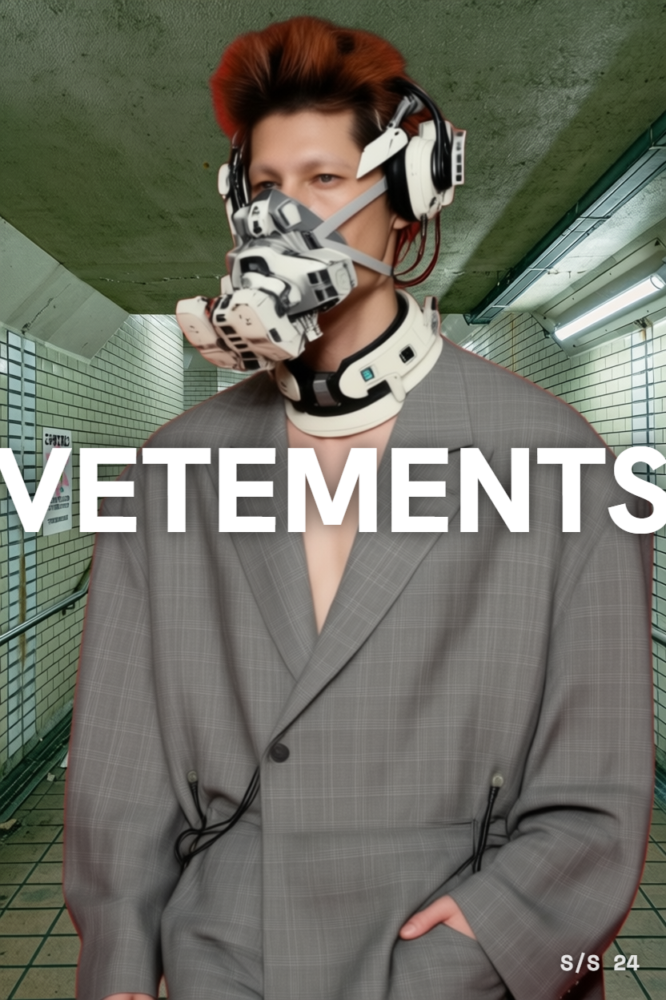
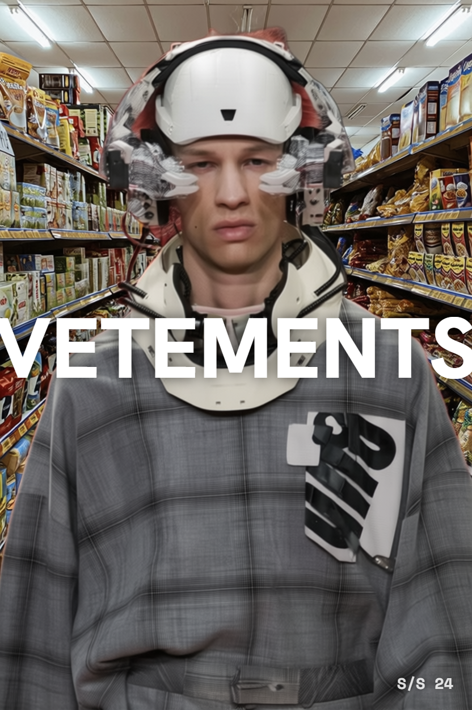
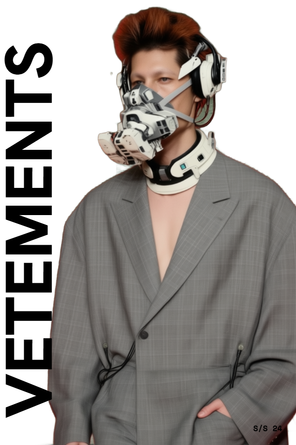
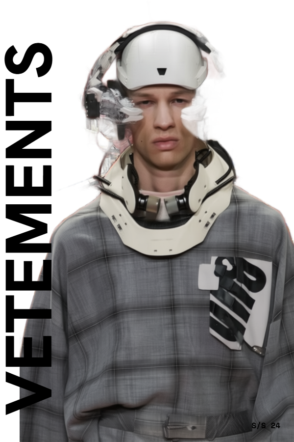
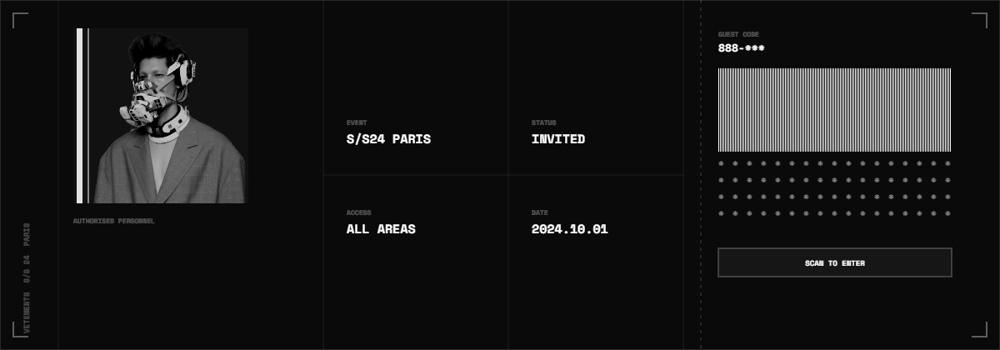
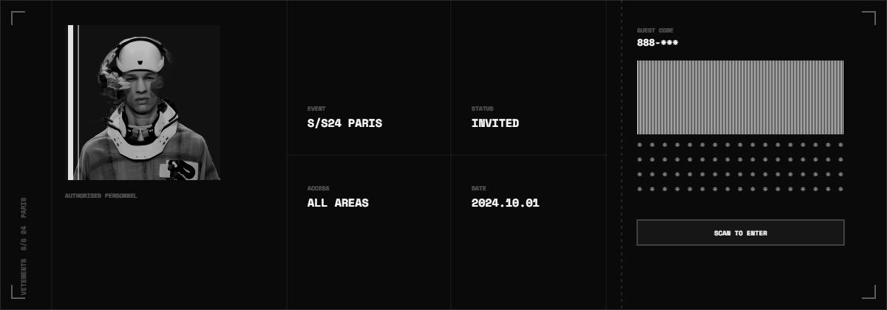
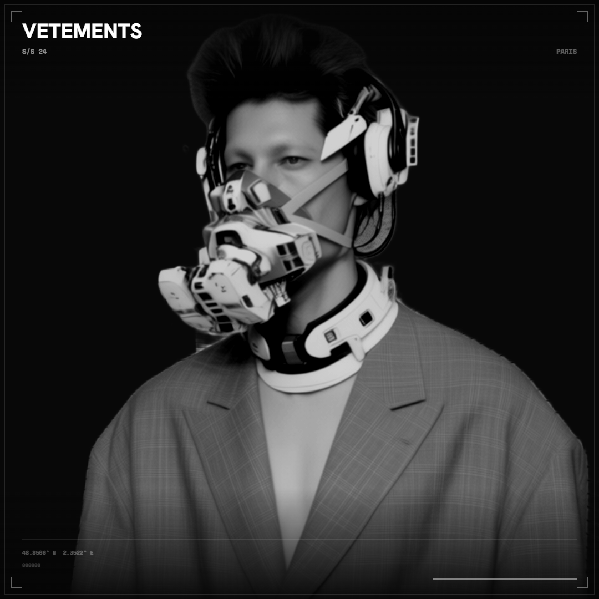
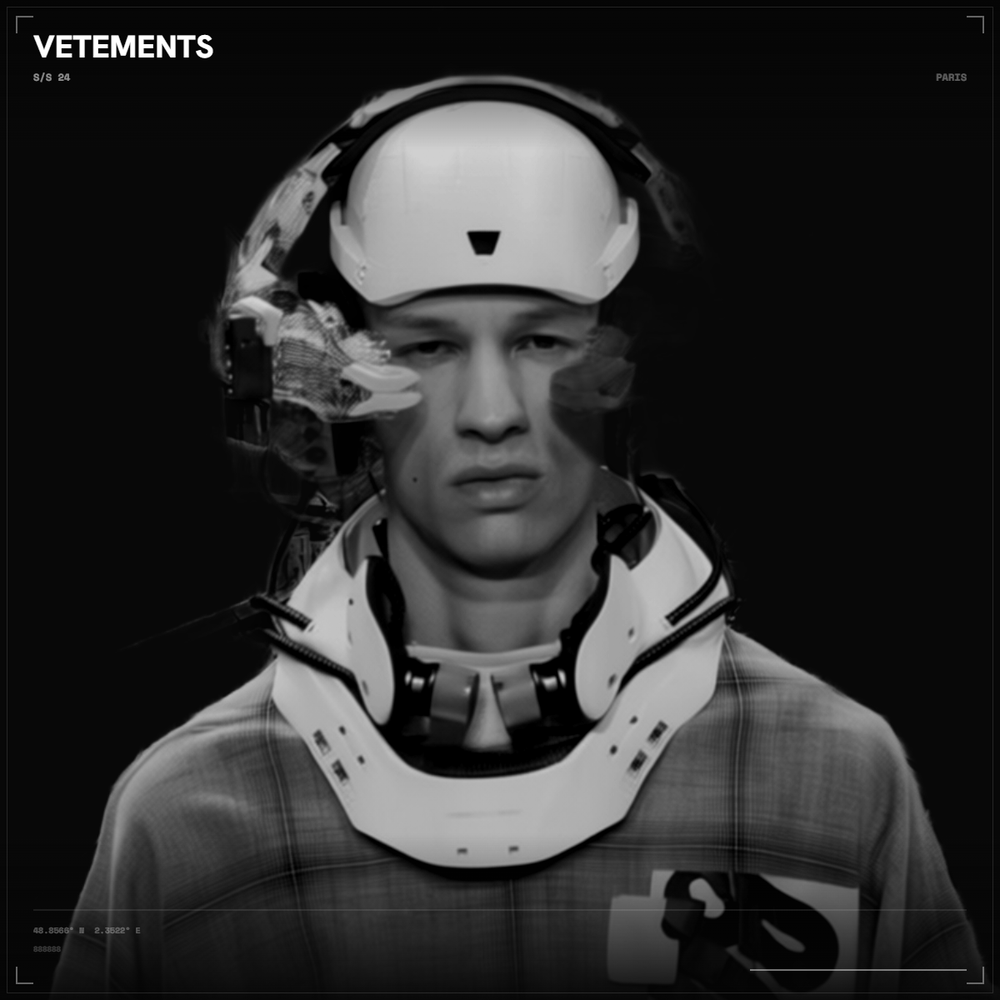

# VETEMENTS S/S24 Generative Fashion Kiosk

> A fully automated, AI-driven event kiosk that generates a personalized editorial identity for each guest composited poster, ID card, souvenir ticket, social media frame, and cinematic short film in real time, on site.

Built as a university project exploring the intersection of generative AI and fashion experience design.

---

## Concept

At a VETEMENTS S/S24 event, guests step in front of a kiosk. They are photographed, choose a background environment, and within minutes receive a complete personal editorial package:

- Their face identity-transferred onto a VETEMENTS campaign figure via ComfyUI
- A procedurally generated cybernetic mask applied over their face — unique every time, consistent aesthetic
- Clothing from the VETEMENTS S/S24 collection composited into the scene
- A postcard-style ID card with background-removed cutout
- A souvenir event ticket with guest code and barcode
- A 1:1 social media frame ready to post
- An 8-second AI-generated cinematic video using their composited image as first frame

No two outputs are identical. The mask is generated fresh for each guest; the ComfyUI workflow recombines identity, garment, and environment on every run.

Every asset carries the VETEMENTS visual language monochrome, industrial, brutalist. The system runs fully unattended. No designer involved after setup.

The kiosk flow is linear and deterministic: **Welcome → Briefing → Photo Capture → Background Selection → Asset Generation → Result + Email Dispatch**. The AI pipeline runs in the background; the guest sees a progress screen.

**The entire UI is designed for touchscreen terminal operation** no mouse required, no keyboard except for email input (custom on-screen keyboard built in), full-screen layout, large tap targets. Intended to run on a dedicated kiosk display at the event.

---

## Generated Outputs

> All outputs were generated by the full pipeline. ComfyUI ran the identity transfer, mask generation, and environment compositing. The frontend handled background removal, canvas assembly, and asset rendering. Two sample guests shown below, each with a unique procedural mask and a different background environment.

### Poster

<table>
<tr>
<td align="center"><b>Example 1 — Metro Corridor</b></td>
<td align="center"><b>Example 2 — Supermarket</b></td>
</tr>
<tr>
<td></td>
<td></td>
</tr>
</table>

*ComfyUI identity transfer with procedurally generated cybernetic mask, unique per guest, composited into selected environment*

---

### ID Card

<table>
<tr>
<td align="center"><b>Example 1</b></td>
<td align="center"><b>Example 2</b></td>
</tr>
<tr>
<td></td>
<td></td>
</tr>
</table>

*Postcard format (600x900 px) — background-removed cutout on white with vertical VETEMENTS logotype*

---

### Souvenir Ticket

<table>
<tr>
<td align="center"><b>Example 1</b></td>
<td align="center"><b>Example 2</b></td>
</tr>
<tr>
<td></td>
<td></td>
</tr>
</table>

*Landscape strip (1200x420 px) — event credential with guest name, barcode, and half-censored guest code*

---

### Social Media Frame

<table>
<tr>
<td align="center"><b>Example 1</b></td>
<td align="center"><b>Example 2</b></td>
</tr>
<tr>
<td></td>
<td></td>
</tr>
</table>

*1200x1200 px — full-bleed editorial square with Paris coordinates, guest name, and VETEMENTS branding*

---

### Cinematic Short Film
*8-second AI video (9:16) generated by fal.ai Veo 3 Fast, using the composited poster as first frame*


---

## Tech Stack

| Layer | Technology |
|---|---|
| Frontend | Next.js 15 (App Router), TypeScript, Tailwind CSS |
| Asset generation | Canvas API (ticket, social, ID card), `@imgly/background-removal` (WASM) |
| AI image compositing | ComfyUI local or cloud (`cloud.comfy.org`) |
| AI video | fal.ai Veo 3 Fast (`fal-ai/veo3/fast/image-to-video`) |
| Email dispatch | Resend API |
| State | `useReducer` state machine single linear flow |

---

## Setup

### Prerequisites

- Node.js 18+
- npm

### Install

```bash
git clone <repo-url>
cd balenciaga-genai
npm install
```

### Environment Variables

Copy `.env.example` to `.env.local` and fill in the keys you have:

```bash
cp .env.example .env.local
```

```env
# ComfyUI pick one option

# Option A: local instance
COMFY_URL=http://localhost:8188
COMFY_API_KEY=

# Option B: ComfyUI Cloud (cloud.comfy.org)
# COMFY_URL=https://cloud.comfy.org
# COMFY_API_KEY=your_key_here

# fal.ai AI video generation (optional, see note below)
FAL_KEY=

# Resend email dispatch (optional)
RESEND_API_KEY=
EMAIL_FROM=VETEMENTS S/S24 <noreply@yourdomain.com>
```

### Run

```bash
npm run dev
```

Open [http://localhost:3000](http://localhost:3000).

---

## Running Without API Keys

The kiosk degrades gracefully when keys are missing:

| Key missing | Behaviour |
|---|---|
| `COMFY_API_KEY` / no ComfyUI | Poster generation skipped mock poster used for all downstream assets |
| `FAL_KEY` | Video generation screen is skipped automatically kiosk proceeds to result |
| `RESEND_API_KEY` | Email dispatch silently fails all assets still shown on screen and downloadable |

**To run a full demo without any API keys:** the kiosk works end-to-end with mock assets. Webcam capture, background selection, asset generation (ID card, ticket, social frame), and the result screen all function without external services.

---

## ComfyUI Workflow Setup

The AI poster compositing requires the workflow file `workflows/poster.json`. The original ComfyUI workflow (`vetements_fw24_comfy_cloud_master_v2_4.json`) is included in `workflows/` — import it directly into ComfyUI.

**Local or cloud — your choice:**

| Option | `COMFY_URL` | `COMFY_API_KEY` |
|---|---|---|
| Local | `http://localhost:8188` | leave empty |
| Cloud (cloud.comfy.org) | `https://cloud.comfy.org` | your key from platform.comfy.org |

**One-time setup:**

1. Open `vetements_fw24_comfy_cloud_master_v2_4` in ComfyUI
2. **Settings → Enable Dev Mode → Save (API Format)**
3. Replace the contents of `workflows/poster.json` with the exported JSON
4. In node `"11"` (INPUT 2 — Frontal Portrait Identity Reference), set:
   ```json
   "image": "__INPUT_IMAGE__"
   ```
5. Set `COMFY_URL` and optionally `COMFY_API_KEY` in `.env.local`

The workflow generates all three background variants in one pass (`05A_FINAL`, `05B_FINAL`, `05C_FINAL`). The kiosk selects the correct output based on the guest's background choice automatically.

---

## Project Structure

```
├── app/
│   ├── api/
│   │   ├── dispatch/       # Resend email with asset attachments
│   │   ├── generate/
│   │   │   ├── poster/     # ComfyUI upload + queue submit
│   │   │   └── video/      # fal.ai Veo 3 Fast submit
│   │   └── status/         # ComfyUI polling (local + cloud)
│   └── page.tsx            # Kiosk entry point
├── components/screens/     # One component per kiosk step
├── lib/steps.ts            # useReducer state machine + FlowState
├── workflows/poster.json   # ComfyUI API-format workflow (needs setup)
├── public/
│   ├── backgrounds/        # Three selectable environments
│   └── mock/               # Fallback poster images (no ComfyUI needed)
└── outputs/                # Sample generated assets
```

---

## Authors

Generative Gestaltung — 4. Semester, Hochschule München

- **Shisir Rijal**
- **[Marko Novak](https://github.com/mrknvk)**
